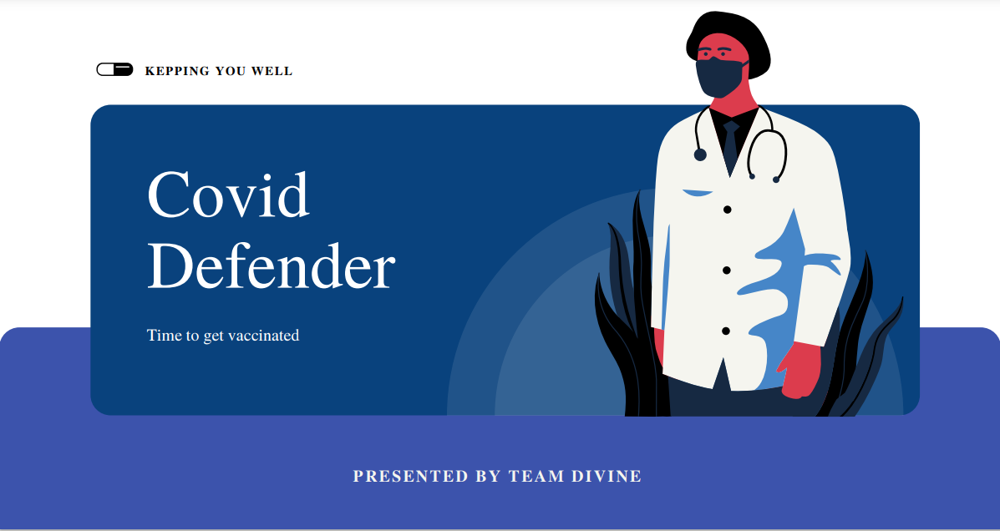
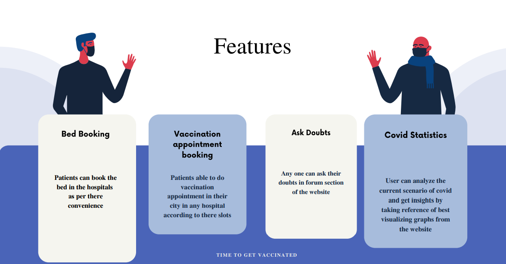
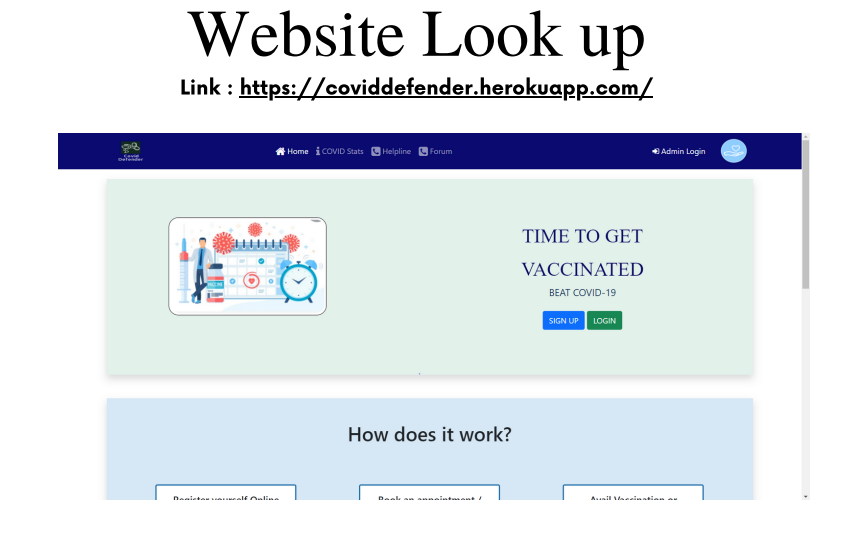

# WEB-HACKS
This project is made in Web-Hack which is organised by DSC VIT,Pune.

## Group members
1. Saurabh Jejurkar
2. Vedant Jore

## Check out the demo of project

## Project Description:-
## Domain:- Healthcare
## Technology:- Web Development
## Languages used:- html,css and Javascript
## Framework used:- Bootstrap
## Deployment Server:- Heroku
We have seen covid-19 outbreak in India in April 2021, it was very dangerous time. We saw that people are not getting covid-19 beds. Some people are struggling for vaccination apointment. So to overcome from this we proposed this website for hospital management and users(patients).

## Features of the website:-
### For Hospitals:-
1. Hospitals can make their profile on website.
2. Login/ signup facility available for hospitals.
3. They can add information regarding covid-19 beds.
4. They can update the count of availabel beds.
5. They can create vaccination slots and update it after person took vaccination.

### For Patients:-
1. Patients can login/ signup through website.
2. Patients can book beds.
3. Patient is able to check status of his/her booking status.
4. Patient is able to take appoinment for covid-19 vaccination.

### Website Look up

